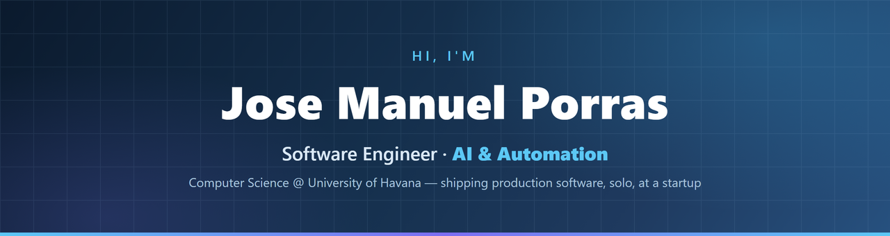

<p align="center">
  <a href="https://josemanuelporras.vercel.app"></a>
  <a href="https://www.linkedin.com/in/jose-manuel-porras-guerra-8a3b843bb"></a>
  <a href="mailto:porrasguerrajosemanuel@gmail.com"></a>
  
  
</p>

---

### 👋 About

I'm a **Computer Science student** and software engineer who **builds AI-driven automation and full-stack web software — and ships it.**

As the **sole technical owner** at **ReAgent Realty Brokerage**, I took the company's web platform from zero to production in one month: Next.js 14 + Supabase, security-hardened, internationalized, with CI/CD and automated tests.

A core part of how I work: I'm fluent with **Claude Code**, authoring custom agent skills and multi-agent workflows that sharply multiply my delivery speed.

```text
focus     →  AI · voice · automation  ·  full-stack web
currently →  building production software solo at a startup
learning  →  language design, distributed systems
```

---

### 🧰 Tech Stack

**Languages**


**Frameworks & Frontend**


**Backend, Data & Tooling**


---

### 🚀 Featured Projects

<table>
  <tr>
    <td width="50%" valign="top">
      <h4>🎙️ <a href="https://github.com/JManuelPorras/hey-jarvis">hey-jarvis</a></h4>
      Windows voice assistant on Claude Code — wake word, GPU speech-to-text, intent routing, streaming TTS, safety-confirmation hook.
      <br/><br/>
      
      
    </td>
    <td width="50%" valign="top">
      <h4>⌨️ <a href="https://github.com/JManuelPorras/faster-whisper-dictation">faster-whisper-dictation</a></h4>
      100% local push-to-talk dictation; faster-whisper <code>large-v3</code> on CUDA, ~1s latency. MIT, bilingual docs.
      <br/><br/>
      
      
    </td>
  </tr>
  <tr>
    <td width="50%" valign="top">
      <h4>🧩 <a href="https://github.com/JManuelPorras/wall-e-interpreter">Wall-E interpreter</a></h4>
      A programming-language interpreter in C#: lexer, parser, semantic analysis, AST — with a WPF GUI.
      <br/><br/>
      
    </td>
    <td width="50%" valign="top">
      <h4>🍰 <a href="https://github.com/JManuelPorras/Sitio-web-Azucararte">Azucararte</a></h4>
      Multipage website (HTML / Tailwind / JS, JSON-driven content) — live in production on Vercel.
      <br/><br/>
      
    </td>
  </tr>
</table>

---

### 📊 GitHub Stats

<p align="center">
  
  
</p>
<p align="center">
  
  
</p>
<p align="center">
  
</p>

---

<p align="center"><i>Open to internships and software engineering roles — remote-friendly. · Native Spanish · Advanced technical English.</i></p>
